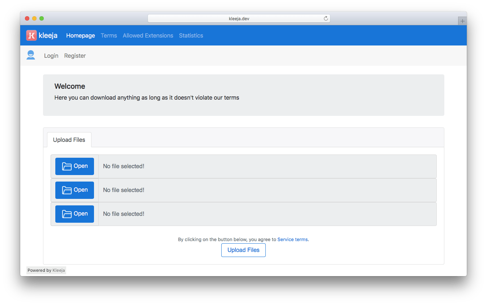
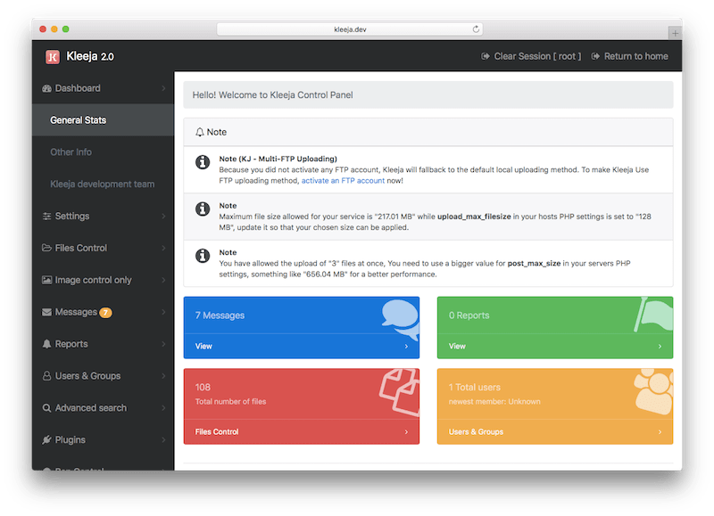

## What is Kleeja

Kleeja is a powerful and easiest way to run File Upload Service on your website. Trusted by thousands of webmasters since 2007. It's written in PHP which is available in almost all hosting solutions.

___
 

## How to
*  📦  &nbsp; [How to Install Kleeja](https://github.com/awssat/kleeja/wiki/How-to-Install-Kleeja).
*  💉  &nbsp; [How to update upgrade/update Kleeja](https://github.com/awssat/kleeja/wiki/How-to-update-upgrade-Kleeja).
*   🎨  &nbsp; [How to install styles on Kleeja](https://github.com/awssat/kleeja/wiki/How-to-install-styles-on-Kleeja).
*   🔌  &nbsp; [How to install plugins on Kleeja](https://github.com/awssat/kleeja/wiki/How-to-install-plugins-on-Kleeja).
*   ℹ️🇺🇸 &nbsp; [Basic Usage - pdf](./docs/How To.pdf).
*   ℹ️🇸🇦 &nbsp; [Basic Usage in Arabic - pdf](./تعليمات الإستخدام.pdf).

___
 

##  Key Features & Highlights

### Multi-lingual
The script allows you to change the language from Admin Panel easily...
### User-friendly interface with multiple file fields:
The admin can choose the number of file fields which will appear to the user in a very elegant way ... the script interface is also very user-friendly.
### Security:
The script has a user sessions system and the Admin user can also sign out from the Admin Panel and act as a normal user...
### Limit file types and sizes:
The script has an advanced file types management system, The Admin can also control the file size for every single file type for users and guests...
### Limited upload space:
You can limit your upload space and the upload center will close automatically with a simple message when it reaches the limit
### Want to use google Analytics?
You can simply add the "Google Analytics" code in the script settings without having to edit the script files..
### Forums user integration:
You can integrate your current (phpBB ,VBulltin) forum users with your upload center easily...
### Watermark:
The Admin can enable the Watermark option, so that the site logo will appear on the uploaded images...
### Image Thumbnails:
The Admin can also enable this option from the Admin Panel so that the users will be given thumbnail links for the uploaded images...
### Report abuse system:
The user can report abusing files from a simple page without even having to enter the abusing file URL... All the reports will be sent to the Admin Panel with a simple report management system and the Admin can also reply to it ...
### Advanced contact system:
The users can contact the Admin and the messages will be sent to the Admin Panel , with the Admin reply ability...
### Cache system:
This script uses cache (APC, or Flat files) so that the pages would load faster...
### Registration control:
The Admin can choose to open or close new user registration at any time with ease...
### Closing the upload center:
The Admin can choose to open or close the upload center with a custom message.
### UTF8:
The script uses UTF8 encoding
### Who's online:
The Admin can enable the (Who's online) option in a elegant way with separation between users and guests...
### Adjustable Download Counter:
Adjust the waiting period for users before they can download (great for showing ads, so users will spend more time on your pages)
### Single or Mass banning system:
The Admin can ban users using a simplified banning system...
### Multiple Admins:
Yes, you can add more than one Admin user from the Admin Panel ...
### Total repair system:
Deletes cache, Re-checks counters and repairs tables...
### Changing file name with two methods:
You can automatically change the uploaded file's name by the "time" function, the "MD5 encryption" function or you can choose not to use any...
### Uploading from URLs (leech):
Yes, the Admin can enable it from the Admin Panel, although this option is in development...
### Advanced Admin Dashboard:
The Admin home page is the starter page for the Admin where statistics and usage details are listed...
### Terms of service:
The user can't upload before agreeing to the terms, which you can easily edit...
### File deletion URL:
because we care about the privacy of our users, a URL will be given to users after a successful uploading process which the users can use for deleting the uploaded files...
### Spams & Flood Protection:
Kleeja has Spam protection and Flood protection, also it comes with Captcha system.

___
 

##  Screenshots

<a href='./screenshot1.png' target="_tab">{:class="img-responsive"}</a>
<a href='./screenshot2.png' target="_tab">{:class="img-responsive"}</a>
